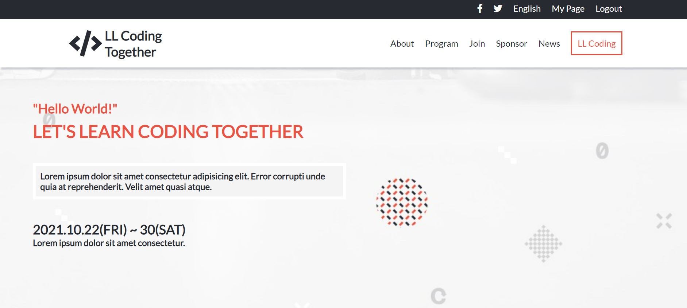
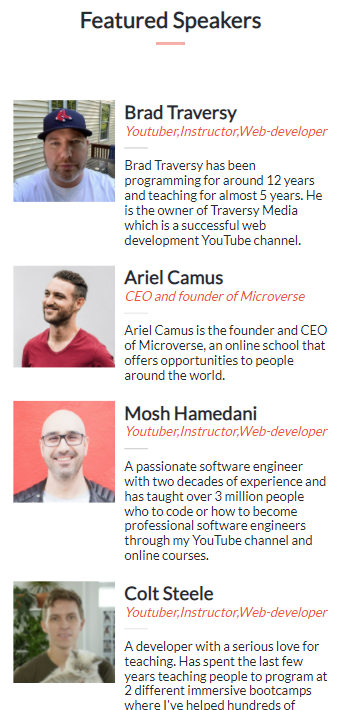

# Capstone-Module-1
> This is the capstone project of the Module 1. 
> The project is  personalized and the topic chosen is about fictional Web development bootcamp. Photos and Dates are not real. 
> The project Design followed Cindy Shin's [template](https://www.behance.net/gallery/29845175/CC-Global-Summit-2015)

# Project contains several sections:

- Header with social icons, logo and navigation
- Headline 
- Program section
- Featured Speakers section
- Partners section
- Footer

# Built with
- HTML5
- CSS3
- JavaScript
- Git and GitHub

# Live Demo
> Project live demo [link](https://wes-isaac.github.io/Capstone_Project_Module_One/);
> video presentation [link](https://wes-isaac.github.io/Capstone_Project_Module_One/);

## Getting Started

To get a local copy up and running follow these simple example steps.

Clone the repo to your local machine.

git clone https://github.com/Wes-Isaac/Capstone_Project_Module_One.git

cd Portfolio

## Authors

👤 **Yishak**

- GitHub: [Yishak ,Wes-Isaac](https://github.com/Wes-Isaac)
- LinkedIn: [@Yishak](https://www.linkedin.com/in/yishak-wesego-b404851a7/)

## 🤝 Contributing
- Contributions, issues, and feature requests are welcome!
- Feel free to check the [issues page](https://github.com/Wes-Isaac/Capstone_Project_Module_One/issues).

# Show your support
Give a ⭐ if you like this project!

# Acknowledgments
- Cindy Shin whose design template was used to create this project.
- Unsplash for providing content related free pictures.
- Thanks to my teammates, learning and coding partners.

# License
This project is MIT licensed.
